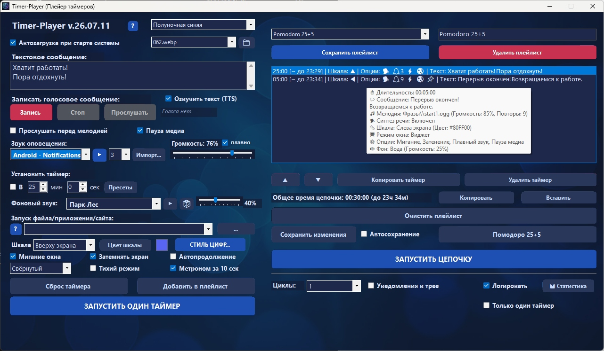
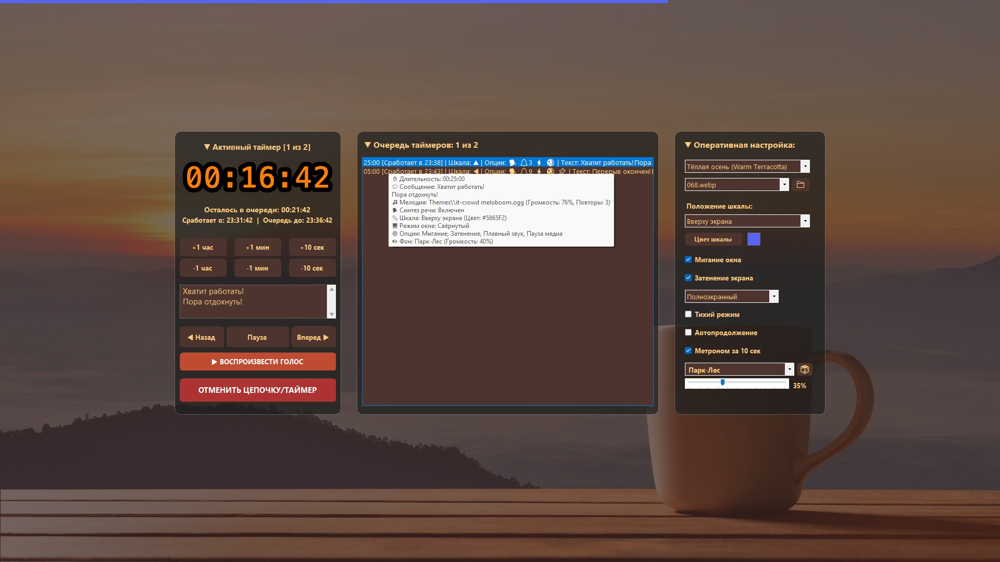
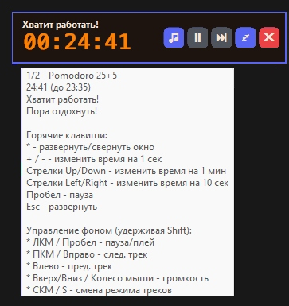
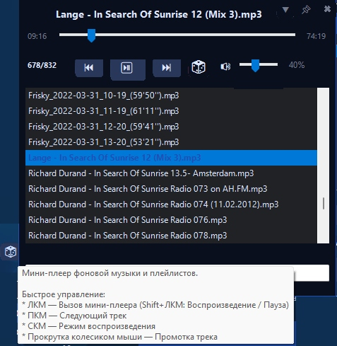

# Timer-Player ⏱️🎵

**Timer-Player** — это продвинутый настольный таймер и менеджер задач с интегрированным плеером фоновых звуков. Программа создана для глубокой фокусировки (Deep Work), управления временем по методу Pomodoro и автоматизации рутинных действий при завершении задач.

Приложение отличается огромным количеством настроек, поддержкой цепочек таймеров (плейлистов), кастомным UI с поддержкой тем оформления и мощным интерфейсом командной строки (CLI).

---

## 📸 Скриншоты интерфейса

<p align="center">
  
  
</p>
<p align="center">
  
  
</p>

---

## ✨ Ключевые возможности

### 🔄 Управление временем и плейлисты
* **Цепочки таймеров:** Создавайте последовательные задачи (например, Pomodoro: 25 мин работы + 5 мин отдыха) и сохраняйте их в JSON-плейлисты. Можно делиться цепочками просто скопировав в буфер обмена.
* **Запуск по расписанию:** Возможность установить срабатывание таймера в конкретное время суток (режим будильника).
* **Групповые циклы:** Зацикливание одиночного таймера или целой цепочки (от 1 до бесконечности).
* **Каскадное оповещение:** Настраиваемая очередь звуков при срабатывании: Синтез речи (TTS) ➔ Записанный с микрофона голос ➔ Выбранная мелодия + Запуск скрипта\файла\сайта\сценария.

### 🎧 Встроенный Эмбиент-плеер (Mini Player)
* **Мультиформатность:** Поддержка локальных файлов (`.mp3`, `.wav`, `.ogg`, `.m4a`) и потоковых плейлистов с онлайн файлами или потоками (`.m3u`, `.m3u8`).
* **Генератор шума:** Огромное число готовых фоновых ambient-звуков, музыки, плейлистов с радио или музыкой. Пресеты белого шума, звуков дождя, камина, леса и т.д..
* **Режимы воспроизведения:** Случайно, последовательно или зацикливание одного трека. Управление громкостью независимо от звука будильника, можно просто как ультра-лёгкий плейер использовать.

### 🎨 Кастомизация и UI
* **Богатый выбор тем:** Десятки встроенных цветовых пресетов (Discord Dark, Cyberpunk, McDonald's, Glassmorphism и др.).
* **Живые обои:** Поддержка локальных изображений и видео (`.mp4`, `.webm`) в качестве фона.
* **Полоса прогресса (Шкала):** Ненавязчивая, настраеваемая полоса прогресса на краях экрана.
* **Режимы окна:** Полноэкранный, Оконный, Свёрнутый (работа в фоне) и **Компактный плавающий виджет** (поверх всех окон).

### ⚙️ Автоматизация и Макросы
* **Тихий режим:** Работа в фоне без окон подтверждения со скрытым выполнением команд.
* **Автопауза медиа:** Автоматическая приостановка музыки (Spotify, YouTube) в системе при срабатывании таймера.
* **Исполнение файлов и скриптов:** Запуск `.exe`, `.bat`, `.ps1` или открытие любых файлов или сайтов по завершении отсчета.


### Разное
* **Свой список быстрых таймеров:** Правой кнопкой по значку трея - Быстрый таймер. Список можно изменить в файле fasttimers.txt.
* **Онлайн радио:** Можно сохранить и использовать плейлист со ссылками на потоки онлайн-радио или на web ссылки на музыкальные файлы.
* **Свои медиа-файлы:** `.ogg`, `.aac`, `.webm`, `.mp3`, `.wma`, `.mp4`, `.mp4a` для звуков будильника или ambient + `.m3u`, `.m3u8` плейлисты. `.webp`, `.jpg`, `.png` для фоновых картинок. `.webm`, `.mp4` для видеофона.

---

## 🚀 Команды, Вебхуки и Макросы

Поле «Запуск файла» поддерживает специальные команды для умного дома и управления ПК. Поддерживается подстановка переменных: `{name}` (имя таймера), `{duration}` (длительность), `{status}` и переменные среды ``.

**Системные макросы:**
* `@shutdown` — Выключить ПК
* `@restart` — Перезагрузка
* `@sleep` — Спящий режим
* `@lock` — Заблокировать экран
* `@exit` — Закрыть Timer-Player

**Вебхуки (скрытые HTTP-запросы):**
* `GET`: `@get http://192.168.1.50:8123/api/webhook/timer_done?name={name}&duration={duration}`
* `POST`: `@post http://192.168.1.50:8123/api/webhook/home_event {"event":"timer_finished", "timer_name":"{name}", "host":""}`

---

## ⌨️ Горячие клавиши (Hotkeys)

### Управление отсчетом (в окне таймера или виджете)
* `Space` (Пробел) — Пауза / Возобновить.
* `Esc` — Отменить таймер (Shift+Esc для полного выхода) / Развернуть виджет.
* `F11` — Полноэкранный режим.
* `*` (NumPad) или `Shift+8` — Переключить Компактный режим (Виджет).
* `Стрелки Вверх / Вниз` — Добавить / Отнять **1 минуту**.
* `Стрелки Вправо / Влево` — Добавить / Отнять **10 секунд**.
* `+` / `-` — Добавить / Отнять **1 секунду**.
* `PageDown` / `PageUp` — Следующий / Предыдущий таймер в цепочке.
* `Home` — Перезапустить текущий таймер.
* `End` — Перемотать таймер (оставить 1 секунду до конца).

### Управление фоновой музыкой (Mini Player)
*(Работает везде при удержании клавиши `Shift`)*
* `Shift + Space` — Play / Pause фоновой музыки.
* `Shift + Вправо / Влево` — Следующий / Предыдущий трек.
* `Shift + Вверх / Вниз` — Громкость фона (шаг 5%).
* `Shift + S` — Смена режима (Случайно / Подряд / Повтор).

---

## 💻 Интерфейс командной строки (CLI)

Программу можно запускать из скриптов (.bat, PowerShell) с заранее заданными параметрами:

| Флаг | Описание | Пример |
| :--- | :--- | :--- |
| `/t`, `/timer` | Время работы (секунды или ЧЧ:ММ:СС) | `/timer 01:23` |
| `/tm`, `/time` | Срабатывание в конкретное время суток | `/time 18:30` |
| `/m`, `/msg` | Текст сообщения | `/msg "Перерыв!"` |
| `/cmd` | Команда или URL для запуска | `/cmd @sleep` |
| `/melody` | Мелодия и число повторов | `/melody 3"Будильник 1"` |
| `/r`, `/repeat` | Число глобальных циклов (без числа = бесконечно) | `/r 2` |
| `/f`, `/flash` | Включить мигание экрана при срабатывании | `/f` |
| `/s`, `/shadow`| Включить затенение экрана при срабатывании | `/s` |
| `/sc`, `/scale`| Цвет и положение шкалы (hex + `u`,`d`,`l`,`r`) | `/sc ffaa00u` |
| `/c`, `/compact`| Запуск сразу в режиме виджета | `/c` |
| `/i`, `/invisible`| Тихий запуск (без звука и окон) | `/i` |
| `/cl`, `/autoclose`| Автоматическое закрытие программы по окончании | `/cl` |
| `/an`, `/autonext`| Автопереход к следующему шагу | `/an` |
| `/pl`, `/playlist`| Загрузить и запустить `.json` плейлист цепочки | `/pl WorkDay.json` |

**Пример автоматизации:**
```bat
TimerPlayer.exe /timer 1500 /msg "Фокус" /melody 2"Гонг" /an /c
TimerPlayer.exe /time 23:00 /cmd @shutdown /i /cl